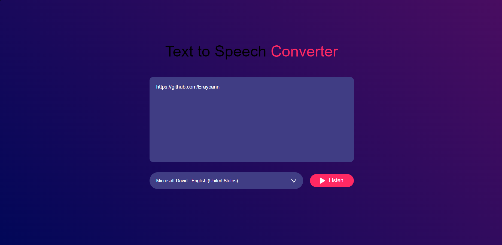

# Text to Speech Converter 🎙️

## Overview
The *Text to Speech Converter* is a web application that enables users to convert written text into speech. It provides a user-friendly interface for entering text, selecting a preferred voice, and listening to the generated speech.

## Technologies Used 🚀
- **HTML**
- **CSS (FlexBox)**
- **JavaScript**
- **Speech Synthesis API**

## Usage 💻
1. **Input Text:**
   - Enter the text you want to convert into speech in the provided textarea.

2. **Voice Selection:**
   - Choose a voice from the dropdown menu to customize the speech output.

3. **Listen Button:**
   - Click the "Listen" button to initiate the text-to-speech conversion.

## Live Demo 🌐
Live Demo : [Voice Converter Demo]()

## Installation
No special installation is required for this project. Simply download the project files and open the `index.html` file in a web browser.

## Contributing 🤝
Feel free to use, modify, and contribute to the project! If you have any questions or feedback, you can reach me at nisagokdemir@gmail.com

## License
This project is licensed under the **MIT License**.
